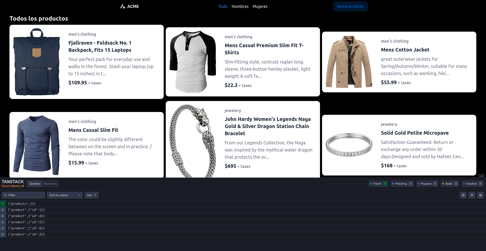
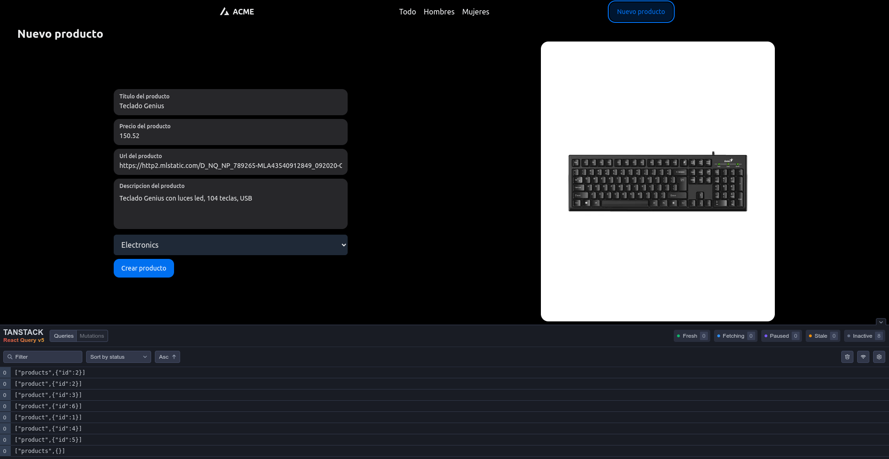
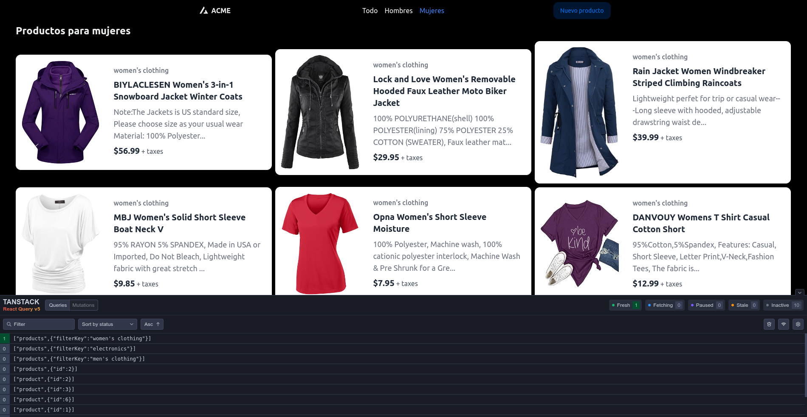

# React Query Store

This is a repository designed to advance the knowledge of the React Query library. The project is a simple application that fetches data from a json-server and displays it in a list. The user can click on the items to see more details about the item. The application uses the React Query library to manage the data fetching and caching.

The application is designed to demonstrate the following features of the React Query library:

- Actions (Queries, Mutations, and Subscriptions)
- Query keys, variables, functions, among others
- Query invalidation and refetching
- Query retries

The application also demonstrates the use of the React Query Devtools to inspect the cache and the queries. The application also uses the useQueryClient hook to manually invalidate queries and refetch them. The application also demonstrates the use of the useMutation hook to perform mutations. At the same time, the application demonstrates the use of optimistic updates to update the cache before the mutation is resolved (also optmistic success and error).By the end of the project, the user should have a good understanding of how to use the React Query library to manage the data fetching and caching in a React application.

## json-server installation

1. Clone the repository of the json-server:
   `git clone https://github.com/matiasagbenitez/fake-api-store.git`
2. Run `npm install` to install the dependencies
3. Run `npm run start` to start the server (the server will run on port 3100)

## React Query Store installation

1. Clone the repository
2. Run `npm install` to install the dependencies
3. Run `npm run dev` to start the application (the application will run on port 5173)

## Images

